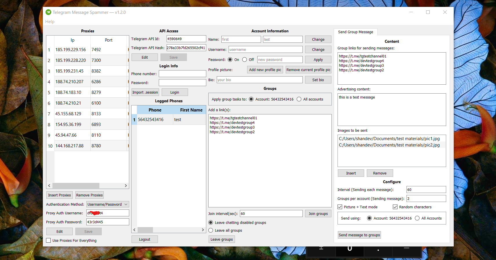
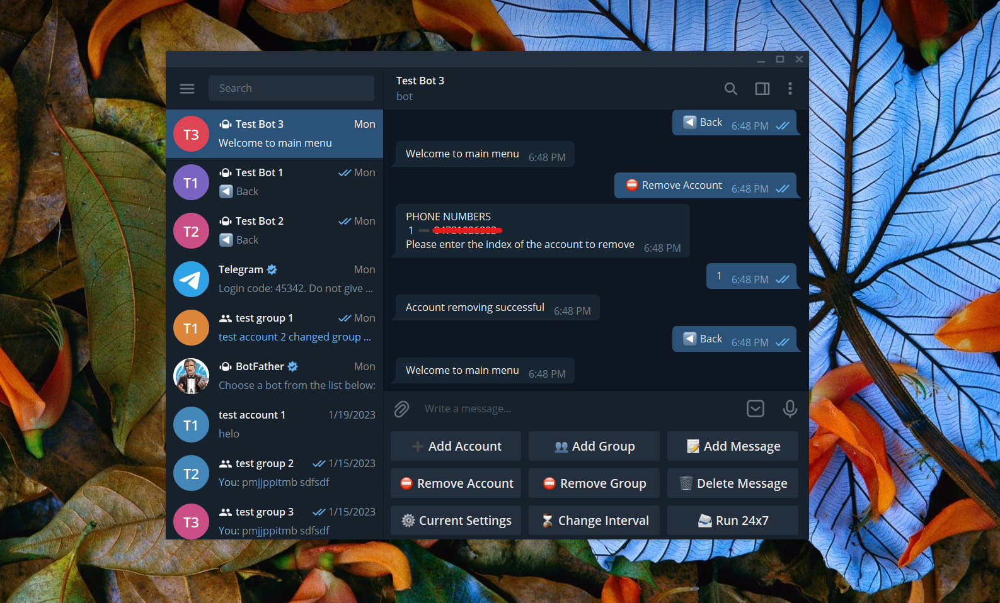
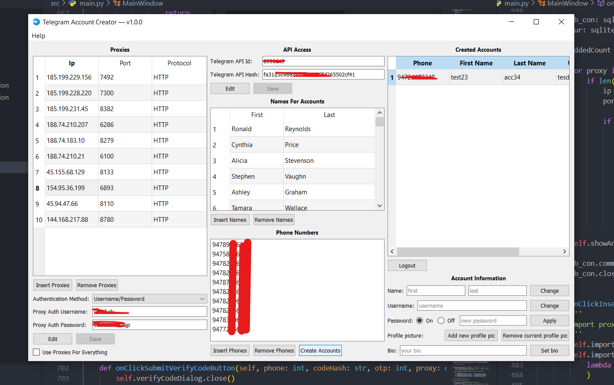

# 
 TELEGRAM UTILITIES (PAID)

 This repository contains some paid telegram utilities that you can use for various telegram-related tasks. All of these utilities are written in python and telethon. You can contact me to get more details about any of these tools.

## Contact me
- Telegram - [@rohith419](https://t.me/rohith419)
- Discord - rohith#2697

Updates of the existing tools and New tools release channel 
https://t.me/rohith_utilities

 

# 1️⃣ Telegram Message Spammer GUI Application

## What is this ❔
This is a simple application to manage accounts and send messages to groups.

## Features
1. Change accounts info (Name, Username, Profile Picture)
2. Auto join to list of groups
3. Send messages to a list of groups
4. Send messages with files/media
5. Send messages using multiple accounts
6. Add proxies to avoid getting banned from telegram

This can be used on windows. If you need to run this on a mac or a Linux please contact me before buying. If you have your specific requirements I can make the modifications according to that.

## How to buy ❔
The price of this tool would be $45. You can buy the program from here. After you make the payment you'll receive the program to the email that you entered at the payment. If you want to make the payment with crypto or with something else please contact me.

## Developed with
- Python 3.9.7
- Telethon 1.24.0
- PySide2

 

# 2️⃣ Telegram Group Members Adder CLI Application

## What is this ❔
This is a simple application that you can use for adding members to your group from other groups.

## Features
1. Auto-join and Scrape multiple groups at the same time
2. Scrape using group links or joined groups
3. Add members to groups & channels
4. Add members with one or more accounts
5. Use proxies when using multiple accounts
6. Scrape members based on their last seen

This can be used on windows If you need to run this on a mac or a Linux please contact me before buying. If you have your specific requirements I can make the modifications according to that. Please contact me to get a demo.

## How to buy ❔
The price of this tool would be $30. You can buy the program from here. After you make the payment you'll receive the program to the email that you entered at the payment. If you want to make the payment with crypto or with something else please contact me.

## Developed with
- Python 3.9.7
- Telethon 1.24.0
- Pandas 1.4.2

 

# 3️⃣ Telegram Message Spammer CLI Application

## What is this ❔
This is a simple application to send messages to groups and members of groups.

## Features
1. Auto join to list of groups
2. Send messages to a list of groups
3. Send messages to members of the group
4. Send messages with files/media
5. Send messages using multiple accounts
6. Add proxies to avoid getting banned from telegram
7. Scrape and send messages to users
8. Send messages using an already scraped member csv based on usernames

This can be used on windows. If you need to run this on a mac or a Linux please contact me before buying. If you have your specific requirements I can make the modifications according to that. Please contact me to get a demo.

## How to buy ❔
The price of this tool would be $25. You can buy the program from here. After you make the payment you'll receive the program to the email that you entered at the payment. If you want to make the payment with crypto or with something else please contact me.

## Developed with
- Python 3.9.7
- Telethon 1.24.0

 

# 4️⃣ Telegram Message Forwarder GUI Application

## What is this ❔
This is a simple application that you can use to forward messages from various channels and groups to your group or channel.

## Features
1. Get messages from multiple groups/channels
2. Forward messages to multiple groups/channels
3. Messages that contain words included in the blacklist won't be forwarded
4. When you forward messages you can choose from only which users you wanna forward messages
5. When forwarding messages you can choose which type of media should only be forwarded
6. If the source message got edited this app will edit the forwarded message too
7. If the source message got deleted this app will delete the forwarded message too

This can be used on windows. If you need to run this on mac or Linux, please contact me before buying. If you have your specific requirements I can make the modifications according to that. Please contact me to get a demo.

## How to buy ❔
The price of this tool would be $25. You can buy the program from here. After you make the payment you'll receive the program to the email that you entered at the payment. If you want to make the payment with crypto or with something else please contact me.

## Developed withP
- ython 3.9.7
- pyside 5.15.2.1
- pyqtdarktheme 1.1.0
- telethon 1.24.0

 

# 5️⃣ Telegram Message Spammer Telegram Bot

## What is this ❔
This can be used to send messages to groups using telegram accounts or the bot itself.

## Features
1. Add accounts
2. Add Groups
3. Add messages with links and media
4. Set an interval for sending messages
5. Send messages 24x7

This can be used on any kind of platform. If you have your specific requirements I can make the modifications according to that.

## How to buy ❔
The price of this tool would be $45. You can buy the program from here. After you make the payment you'll receive the program to the email that you entered at the payment. If you want to make the payment with crypto or with something else please contact me.

## Developed with
- Python 3.9.7
- Telethon 1.24.0

# 6️⃣ Telegram Account Creator GUI Application

## What is this ❔
This application can be used to manage telegram accounts and create new telegram accounts.

## Features
1. Create telegram accounts
2. Change account name/username/bio
3. Change account profile picture
4. Use proxies when creating accounts to avoid getting banned

This can be used on windows. If you need to run this on a mac or a Linux please contact me before buying. If you have your specific requirements I can make the modifications according to that.

## How to buy ❔
The price of this tool would be $35. You can buy the program from here. After you make the payment you'll receive the program to the email that you entered at the payment. If you want to make the payment with crypto or with something else please contact me.

## Developed with
- Python 3.9.7
- Telethon 1.24.0
- PySide2