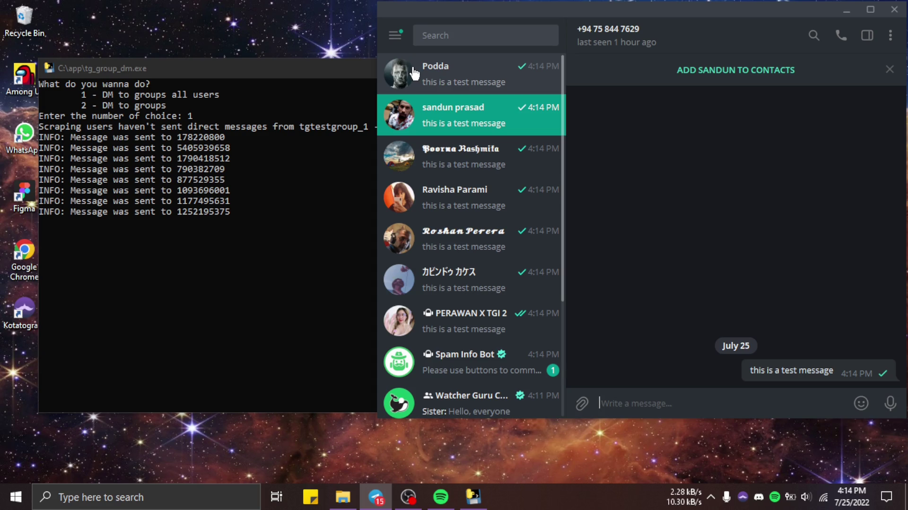
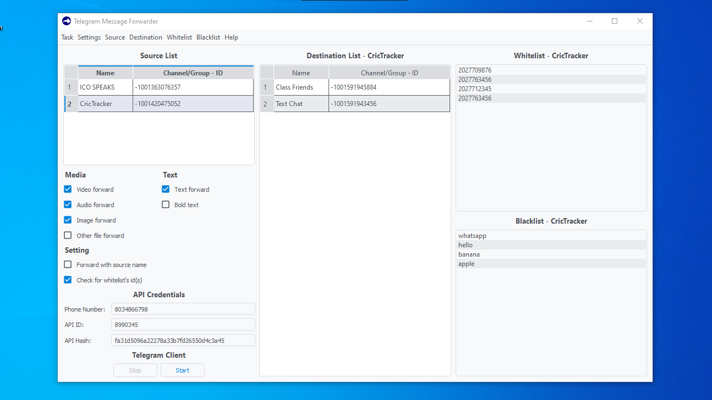

# 
 TELEGRAM UTILITIES (PAID)

 This repository contains some paid telegram utilities that you can use for various telegram related tasks. All of these utilities are written in python and telethon.

## Contact me
- Telegram - [@shandev4](https://t.me/shandev4)
- Discord - shandev#5722

 

# 1️⃣ Telegram Group Members Adder

## What is this ❔
This is a simple application that you can use for adding members to your group from other groups.

## Features
1. Auto-join and Scrape multiple groups at the same time
2. Scrape using group links or joined groups
3. Add members to groups & channels
4. Add members with one or more accounts
5. Use proxies when using multiple accounts
6. This can be used on windows If you need to run this on a mac or a Linux please contact me before buying.

If you have your specific requirements I can make the modifications according to that. Please contact me to get a demo or more details.

## How to buy ❔
The price of this tool would be $30. You can buy the program from here. After you make the payment you'll receive the program to the email that you entered at the payment.

If you want to make the payment with crypto or with something else please contact me.

## Developed with
- Python 3.9.7
- Telethon 1.24.0
- Pandas 1.4.2

 

# 2️⃣ Telegram Message Spammer

## What is this ❔
This is a simple application to send messages to groups and members of groups.

## Features
1. Auto join to list of groups
2. Send messages to a list of groups
3. Send messages to members of the group
4. Send messages with files/media
5. Send messages using multiple accounts
6. Add proxies to avoid getting banned from telegram
7. This can be used on windows. If you need to run this on a mac or a Linux please contact me before buying

If you have your specific requirements I can make the modifications according to that. Please contact me to get a demo or more details.

## How to buy ❔
The price of this tool would be $25. You can buy the program from here. After you make the payment you'll receive the program to the email that you entered at the payment.

If you want to make the payment with crypto or with something else please contact me.

## Developed with
- Python 3.9.7
- Telethon 1.24.0

 

# 3️⃣ Telegram Message Forwarder

## What is this ❔
This is a simple application that you can use to forward messages from various channels and groups to your group or channel.

## Features
1. Get messages from multiple groups/channels
2. Forward messages to multiple groups/channels
3. Messages that contain words included in the blacklist won't be forwarded
4. When you forward messages you can choose from only which users you wanna forward messages
5. When forwarding messages you can choose which type of media should only be forwarded
6. If the source message got edited this app will edit the forwarded message too
7. If the source message got deleted this app will delete the forwarded message too
8. This can be used on windows. If you need to run this on mac or Linux, please contact me before buying

If you have your specific requirements I can make the modifications according to that. Please contact me to get a demo or more details.

## How to buy ❔
The price of this tool would be $25. You can buy the program from [here](https://www.buymeacoffee.com/shandev4/e/96317). After you make the payment you'll receive the program to the email that you entered at the payment.
 

 
If you want to make the payment with crypto or with something else please contact me.

## Developed with
- python 3.9.7
- pyside 5.15.2.1
- pyqtdarktheme 1.1.0
- telethon 1.24.0
