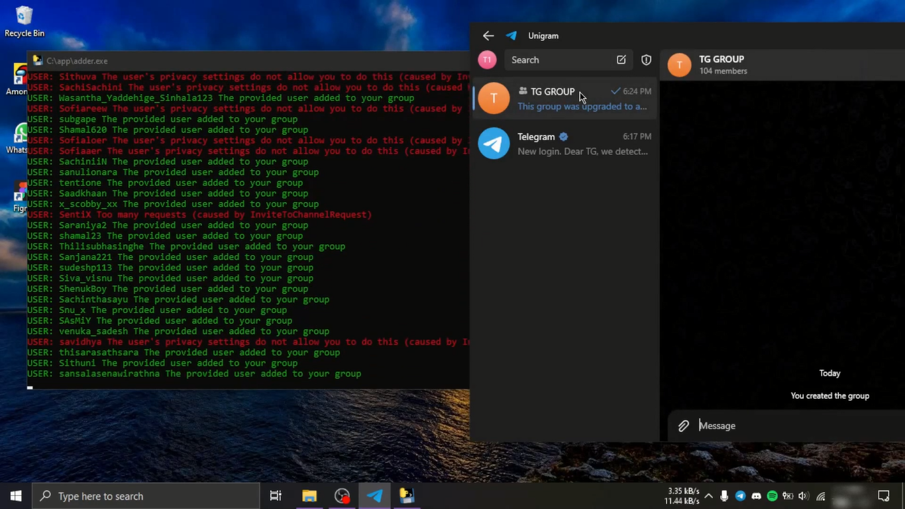

# 
 Telegram Group Members Adder

## What is this ❔
This is a simple application that you can use for adding members to your group from other groups.

## Features
1. Auto-join and Scrape multiple groups at the same time
2. Scrape using group links or joined groups
3. Add members to groups & channels
4. Add members with one or more accounts
5. Use proxies when using multiple accounts
6. This can be used on windows If you need to run this on a mac or a Linux please contact me before buying.

If you have your specific requirements I can make the modifications according to that.

<a href="https://mega.nz/file/1mJVmK4I#SW_UbKXh_XeCt8DO7mnDGOgNoaDJ8zw0JBxX8jrb8ss">Click here to watch the demo</a>

## How to buy ❔
The price of this tool would be $30. You can buy the program from here. After you make the payment you'll receive the program to the email that you entered at the payment.

If you want to make the payment with crypto or with something else please contact me.

## Developed with
- Python 3.9.7
- Telethon 1.24.0
- Pandas 1.4.2

## Contact me
- Telegram - [@shandev4](https://t.me/shandev4)
- Discord - shandev#5722